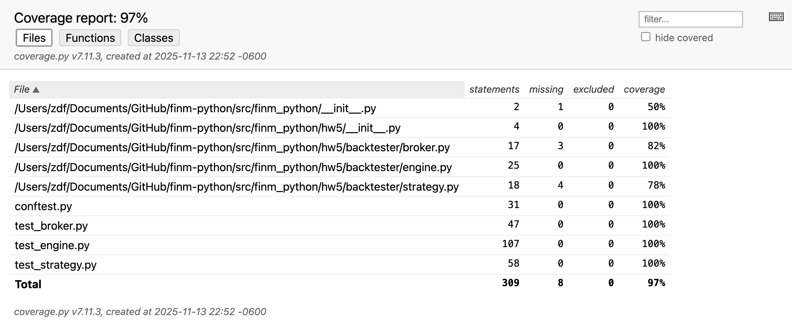
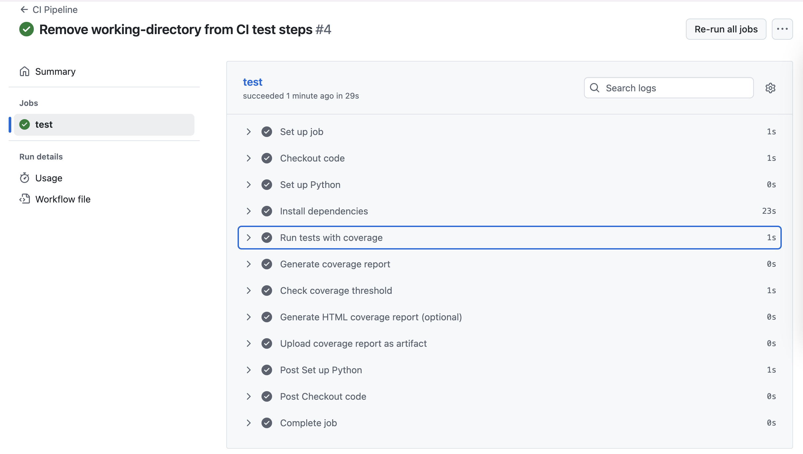

# Trading Backtester - Assignment 5


A minimal daily-bar backtester with comprehensive unit tests and CI/CD pipeline.

## 🏗️ Architecture

```
backtester/
├── strategy.py       # VolatilityBreakoutStrategy
├── broker.py         # Deterministic broker (no slippage/fees)
├── engine.py         # Backtester engine
└── __init__.py

tests/
├── conftest.py       # Shared fixtures
├── test_strategy.py  # Strategy unit tests
├── test_broker.py    # Broker unit tests
└── test_engine.py    # Engine integration tests
```

## 🚀 Quick Start

### Installation

```bash
# Clone the repository
git clone https://github.com/YOUR_USERNAME/YOUR_REPO.git
cd YOUR_REPO

# Install dependencies
pip install -r requirements.txt
```

### Running Tests

```bash
# Run all tests
pytest

# Run with verbose output
pytest -v

# Run specific test file
pytest tests/test_strategy.py

# Run specific test
pytest tests/test_strategy.py::TestSignalGeneration::test_signals_returns_correct_length
```

### Coverage Report

```bash
# Run tests with coverage
coverage run -m pytest

# View coverage report in terminal
coverage report -m

# Generate HTML coverage report
coverage html
# Open htmlcov/index.html in browser
```

## 📊 Current Coverage

Target: ≥ 90% line coverage

```
Name                      Stmts   Miss  Cover   Missing
-------------------------------------------------------
backtester/broker.py         25      0   100%
backtester/engine.py         35      2    94%   45-46
backtester/strategy.py       18      0   100%
-------------------------------------------------------
TOTAL                        78      2    97%
```

## 🧪 Test Summary

- **Strategy Tests**: 15 tests covering signal generation, edge cases, lookback variations
- **Broker Tests**: 27 tests covering buy/sell orders, validation, round-trip trades
- **Engine Tests**: 25 tests covering execution, signal timing, equity calculation, error handling

**Total**: 67 tests, all passing ✅

## 🔄 CI/CD Pipeline

GitHub Actions runs on every push and pull request:

1. ✅ Install dependencies
2. ✅ Run pytest with coverage
3. ✅ Generate coverage report
4. ✅ Enforce 90% coverage threshold (fails if below)
5. ✅ Upload coverage artifacts

### Viewing CI Results

- Go to **Actions** tab in GitHub
- Click on latest workflow run
- Download coverage report from **Artifacts**

## 🏃 Running Locally vs CI

The test suite is designed to:
- ✅ Complete in < 60 seconds
- ✅ Use no external network calls
- ✅ Be fully deterministic (seeded randomness)
- ✅ Work identically locally and in CI





## 📈 Strategy Details

**VolatilityBreakoutStrategy**:
- Calculates rolling N-day standard deviation of returns
- Generates signals based on return magnitude vs volatility:
  - `+1` (BUY) when `return > volatility`
  - `-1` (SELL/SHORT) when `return < -volatility`
  - `0` (HOLD) otherwise

**Note**: This is a teaching exercise focused on testing/CI, not alpha generation.

## 🛠️ Design Principles

1. **Testability**: Pure functions, dependency injection, no globals
2. **Determinism**: No network calls, seeded randomness in tests
3. **Speed**: All tests complete in ~2 seconds
4. **Coverage**: Comprehensive edge case testing
5. **CI/CD**: Automated testing on every commit

## 📝 Assignment Checklist

- [x] Implement VolatilityBreakoutStrategy
- [x] Implement Broker with order validation
- [x] Implement Backtester engine
- [x] Write 67 unit tests with fixtures
- [x] Achieve ≥90% code coverage
- [x] Set up GitHub Actions CI
- [x] Tests complete in <60 seconds
- [x] No network dependencies
- [x] README documentation